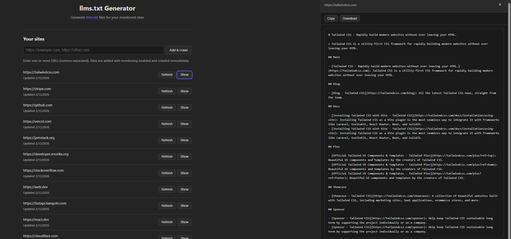

# llms.txt Generator

Generate [llms.txt](https://llmstxt.org/) files for websites. Add URLs, crawl sites, and download generated files. Sites are monitored and re-crawled on a schedule.



## Local development

```bash
# Backend
cd backend
pip install -r requirements.txt
cp ../.env.example .env   # edit with your DATABASE_URL
uvicorn main:app --reload

# Frontend (separate terminal)
cd frontend
npm install
npm run dev
```

Open http://localhost:5173

## Deploy (single service)

Build the frontend, then deploy the backend. The API serves both.

**Build:**
```bash
cd frontend && npm ci && npm run build
```

**Deploy to Render:**
1. Connect your repo
2. Use `render.yaml` (or set Build: `cd frontend && npm ci && npm run build && cd ../backend && pip install -r requirements.txt`, Start: `cd backend && uvicorn main:app --host 0.0.0.0 --port $PORT`)
3. Set env: `DATABASE_URL`, `CRON_SECRET`

**Deploy to Railway:**
1. Connect repo
2. Build: `cd frontend && npm ci && npm run build && cd ../backend && pip install -r requirements.txt`
3. Start: `cd backend && uvicorn main:app --host 0.0.0.0 --port $PORT`
4. Set env: `DATABASE_URL`, `CRON_SECRET`

## Cron job (scheduled re-crawls)

Sites are re-crawled based on their `monitor_schedule` (hourly, daily, weekly). A cron job must call the API to trigger due crawls.

**Using [cron-job.org](https://cron-job.org) (free):**

1. Create an account and add a new cron job
2. **URL:** `https://your-app-url.onrender.com/api/cron/crawl-due`
3. **Method:** POST
4. **Schedule:** Every 15 minutes (or hourly—often enough to catch due sites)
5. **Request headers:**
   - `X-Cron-Secret`: `your-CRON_SECRET-value` (must match the env var)

**Using Render Cron Jobs:** Add a cron job service in `render.yaml` that POSTs to `/api/cron/crawl-due` with the `X-Cron-Secret` header.

**Manual test:**
```bash
curl -X POST https://your-app-url/api/cron/crawl-due \
  -H "X-Cron-Secret: your-CRON_SECRET-value"
```
